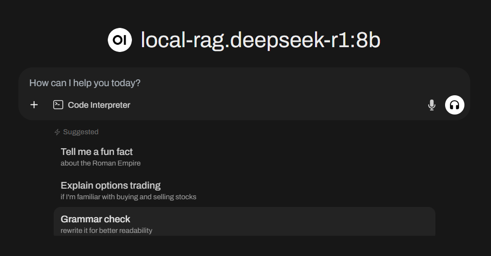
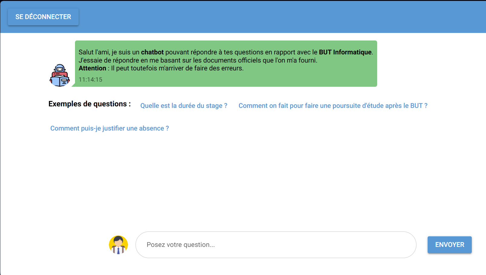

# RAG Project with Langchain integration

## 📝 Overview

This project is a **Retrieval-Augmented Generation (RAG) system** using Langchain for embeddings and FAISS indexing. It allows querying an LLM with context retrieved from indexed documents.

## ✨ Features

-   📂 Loads and indexes PDF documents into a FAISS vector store.
-   🔎 Uses `intfloat/multilingual-e5-base` for text embeddings.
-   🚀 Provides a **FastAPI-based chat API** compatible with OpenAI-style requests.
-   📜 Retrieves and formats context from indexed documents.
-   🤖 Queries an **Ollama** server for responses.

## ⬇️ Installation

### 🔧 Prerequisites

-   A running **[Ollama](https://github.com/ollama/ollama?tab=readme-ov-file)** server (remote or local) :
    `ollama serve`

### 📦 Install Dependencies

Run the following command to install required dependencies:  
`pip install -r requirements.txt`

---

# 🚀 Usage

### 💬 Interaction Methods

You can interact with the system in multiple ways:

-   🖥️ Terminal: Run rag.py for direct testing.
-   🔗 API: Use openai-rag_api.py to query via an API.
-   🌐 Web Interface: Integrate with OpenWebUI for a user-friendly interface.
-   😀 NiceGUI Chatbot: Talk with a simple chatbot.

### 1️⃣ Index Documents (To be done only once, when you don't want to change the documents)

-   Add your PDF files to "data/pdf" folder.

-   Run the `load_index.py` script:

This will generate a FAISS index and save it in indexes/global_index.

### 2️⃣ Start API Server

Run the FastAPI server:
`uvicorn src.openai_rag_api:app --host 0.0.0.0 --port 8000`

### 3️⃣ Query API

### 🔹 OpenAI-Compatible Chat Endpoint

#### Windows Powershell :

Post request :

```
$response = Invoke-RestMethod -Uri "http://127.0.0.1:8000/v1/chat/completions" -Method Post -ContentType "application/json" -Body (@{
    model="Model name";
    messages=@(@{role="user"; content="Your question"});
    index_path="indexes/global_index";
    docs_max=6;
    ollama_server_url="Server url"
} | ConvertTo-Json)
```

Display the response :

`$response | ConvertTo-Json`

#### Linux & MacOS:

Post request :

```
response=$(curl -X POST "http://127.0.0.1:8000/v1/chat/completions" \
     -H "Content-Type: application/json" \
     -d '{
          "model": "Model name",
          "messages": [{"role": "user", "content": "Your question"}],
          "index_path": "indexes/dataset_indexes/e5base_Full",
          "docs_max": 6,
          "ollama_server_url": "Server url"
        }')
```

Display the response :
`echo "$response"`

### 🔹 Available Models Endpoint

#### Windows Powershell:

`Invoke-RestMethod -Uri "http://127.0.0.1:8000/v1/models" -Method Get`

#### Linux & MacOS:

`curl -X GET "http://127.0.0.1:8000/v1/models"`

---

## 🤖 Openwebui integration

### 🔧 Prerequisites

-   A running **[Open Webui](https://docs.openwebui.com)** server :
    `open-webui serve`

### Configuration steps:

-   1️⃣ Go to Settings -> Admin Settings -> Connections

-   2️⃣ Desactivate "Ollama API"

-   3️⃣ Activate "Direct Connections"

-   4️⃣ In "Manage API OpenAI connections" add a new connection :

    -   In the URL field : http://127.0.0.1:8000/v1

    -   For the key and prefix, choose what you want.

### Choose your model and use it !



---

## ⏱️ RAG Evaluation

Benchmarks are available here: https://drive.google.com/drive/folders/1-7sRiN-qAH5SUz-HZGdB_tFyHSjDoHF1?usp=sharing

I used a **dynamic similarity** evaluation with this model: `dangvantuan/sentence-camembert-base`.

I also tried with **[Gensim](https://radimrehurek.com/gensim/auto_examples/tutorials/run_scm.html#sphx-glr-auto-examples-tutorials-run-scm-py)** **static similarity** evaluation:

You can try it by setting `DYNAMIC_SIMILARITY` to `False`.

### To reproduce them:

### 🔹Login to your huggingface account

Benchmarks uses a HuggingFace model for answer evaluation and datasets, so you will have to login.

`huggingface-cli login`

Then paste your token with right click.

-   ### Benchmark Using Questions from a CSV File

    -   Launch `rag_benchmark.py`
    -   You can tweak : **model**, **index**, **input file**, etc, with the static variables.

-   ### Dataset benchmark

    -   Launch `piaf_benchmark.py`
    -   It uses the french question-answering dataset : `AgentPublic/piaf`.
    -   So you can also tweak the sample size : `QUESTIONS_AMOUNT`.

---

## 🤖💬 NiceGUI Chatbot

You can test the rag through a simple NiceGUI application.

-   1️⃣ Launch the `main.py` file in the `nicegui_app` folder.
-   2️⃣ It will open in your browser at `http://127.0.0.1:8080`.
-   3️⃣ Create an account and login.

-   The conversation is saved while the API is running.
-   Credentials are stored in an SQLite database.


